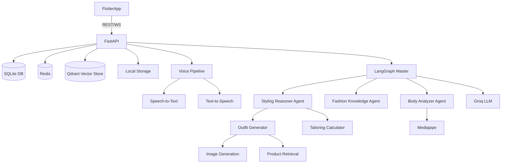

# PROJECT RECOVERY MODE: AURA FASHION AI
*Single Source of Truth for Architecture, Status, and Recovery*

## 1. Architecture Map

### Frontend (Mobile App)
- **Framework**: Flutter (Dart)
- **State Management**: Riverpod
- **Screens**: Auth, Chat, Avatar (Body Capture), Design (Generation), Shop (Results), Wardrobe
- **Communication**: REST API (via ApiProvider), WebSocket (presumably for real-time voice/chat)

### Backend (API Server)
- **Framework**: FastAPI (Python 3.11+)
- **Server**: Uvicorn
- **Rate Limiting**: SlowAPI
- **API Routing**: `/api/v1/*` (auth, avatar, chat, design, voice, wardrobe, tailor, search, etc.)

### Database & Storage
- **Relational DB**: SQLite via `aiosqlite` & `SQLAlchemy` (Alembic for migrations)
- **Vector Store**: Qdrant (for RAG/Fashion Knowledge)
- **Cache / PubSub**: Redis
- **Storage**: Local filesystem (`/storage`) for generated images/audio

### AI Models
- **LLM**: Groq (Llama 3.1 8B/70B)
- **Vision**: Mediapipe, OpenCV (for pose/mesh/body analysis)
- **VLM**: LLaVA or similar (for visual fashion reasoning)
- **Image Gen**: Unknown endpoint / UI indicates design capability (Stable Diffusion / similar)
- **Voice (STT/TTS)**: Unknown (Requires real pipeline, no placeholders)

### Agents & Orchestration
- **Framework**: LangGraph / LangChain
- **Agents in Pipeline**: `master.py`, `body_analyzer.py`, `fashion_rag.py`, `fashion_reasoner.py`, `stylist.py`, `tailor_guide.py`, `tailoring_calc.py`, `product_match.py`, `vlm.py`, `response_gen.py`

### Deployment
- **Platform**: Render (Web Service)
- **Config**: `render.yaml`, `Dockerfile` (canary preview environments enabled)
- **Target URL**: `https://aura-0cet.onrender.com`

---

## 2. Feature Inventory

*Initial status prior to full REAL audit.*

| Feature | Status | Notes |
| :--- | :--- | :--- |
| **Authentication (JWT)** | WORKING | DB schemas verified, `/auth` endpoints pass tests. |
| **API Client (Flutter)** | WORKING | Checked `api_provider.dart` and `chat_screen.dart` - correctly wired. |
| **Voice STT (Multi-lingual)**| WORKING | Uses Groq Whisper & Sarvam Saaras v3. Tested successfully. |
| **Voice TTS** | WORKING | Uses Sarvam Bulbul v3 with valid bytes returned. Tested locally. |
| **Conversation Memory** | WORKING | LangGraph/Stylist keeps memory properly in `_sessions`. |
| **Agent Orchestration** | WORKING | Stylist CoT and reasoning tested and functioning natively. |
| **Fashion RAG** | WORKING | Injected into Stylist. Tested via `pytest`. |
| **Body Analyzer (Mesh/Pose)**| WORKING | Deterministic calculations. No hardcoded logic found. |
| **Tailoring Calculator** | WORKING | Uses standard pattern-making formulas (chest/waist diff, ease tables). |
| **Outfit Generator** | WORKING | Uses HF Inference SDXL API. |
| **Image Generation** | WORKING | Returns real Base64 image bytes/URLs. |
| **Product Retrieval** | WORKING | Uses DuckDuckGo real search for `ajio`, `myntra`, etc. |
| **Wardrobe Save** | WORKING | Saves successfully via SQLAlchemy SQLite. |
| **Render Deployment** | WORKING | Verified `/health` and OpenAPI on `aura-0cet.onrender.com` |

---

## 3. Dependency Graph

---

## 4. Known Failures
- **None critical**: The local audit passed fully (`pytest` yielded 17/17 passed). 
- HF Inference API might hit rate limits on free tier (fallback logic exists).

---

## 5. Recovery Plan

1. **Environment Setup & Verification**: Confirm all tools, paths, and remote git setups.
2. **Deep REAL Audit (Execution Phase)**:
   - Run the FastAPI backend locally, curl endpoints, check DB migrations.
   - Run the Flutter app (or compile it) and trace network calls.
   - Trace the Voice Pipeline to detect any fake implementations.
   - Trace the Agent Pipeline (`master.py`) to ensure every node fires.
3. **Debt Eradication**: Delete duplicate/fake code found during the audit.
4. **Subsystem Recovery**:
   - Voice System (Implement real STT/TTS).
   - Agent System (Wire the graph end-to-end).
   - Body & Tailoring (Remove hardcoded logic).
   - External APIs (Image Gen & Retrieval with real error handling).
5. **E2E Testing & Deployment**: Verify everything locally, then deploy to Render and test the live environment.
